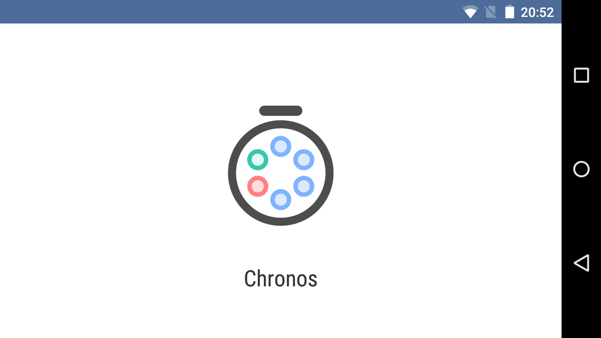
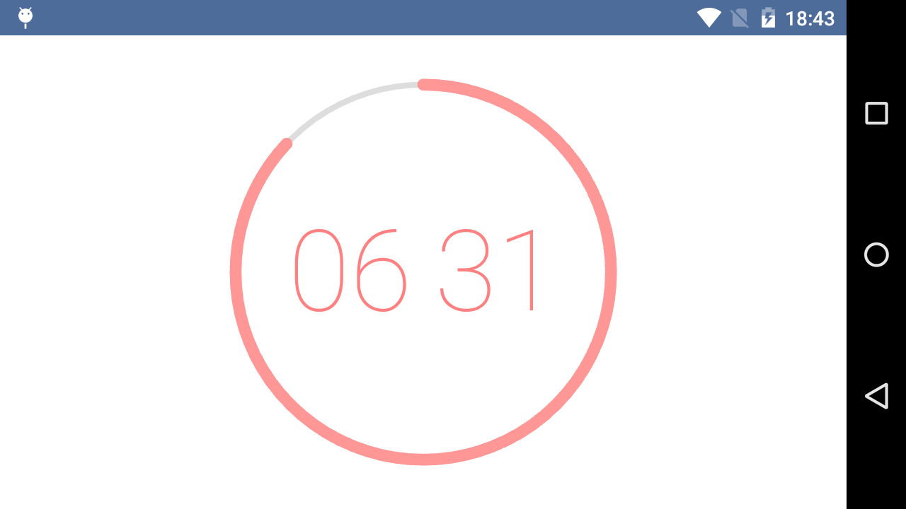

# 
Inspired by the [Pomodoro Technique](https://en.wikipedia.org/wiki/Pomodoro_Technique), this nice little app is a countdown timer that follows my traditional work model: 50 minutes of focused work and 10 minute break.

## Architecture
Based on the principles of Clean Architecture, the app has been divided into 3 layers: Main, UI, and Domain.

* Main is responsible for starting the app. It only depends on the UI layer.
* UI contains all the presentation rules. It only depends on the Domain layer.
* Domain contains all the business rules. It doesn't depend on any layer.

## Principles applied in the project
* [Clean Code](https://www.amazon.com/Clean-Code-Handbook-Software-Craftsmanship/dp/0132350882)
* [Clean Architecture](https://blog.cleancoder.com/uncle-bob/2012/08/13/the-clean-architecture.html)
* [Minimalism](https://visme.co/blog/minimalist-graphic-design/)
* [Getting Real](https://basecamp.com/books/getting-real)

## Screenshots

## Iterations of icon design
